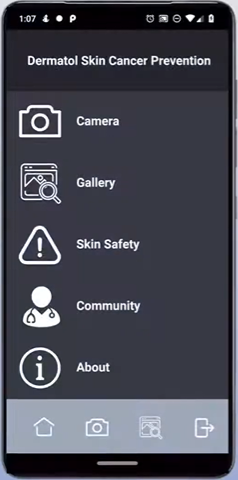

<h1 align="center">Dermatol</h1> 

<p align="center">
Dermatol is a multiplatform application that: detects signs of skin cancer lesions using bleeding-edge AI technqiues, educates the user about skin cancer, and connects the user to the local dermatology community. This app was created as submission for the 2020 Livewell Student App Challenge with my group members Nico (GH: nico-jimene), and Aakash (GH: aakosk). I was the developer of the group so I was tasked with coding the app, designing the user interface, implementing all of the apps native features, securing the local database/user authentication system, building all the core functionality, and interfacing the machine learning components.
</p>

<p align="center">
A link to an online demo version can be found here: <a href="https://www.youtube.com/watch?v=x25HVwbnF2c" target="_blank">youtube.com/watch?v=x25HVwbnF2c</a>
</p>

## App Platform

Dermatol was made using Python, Kivy, and several machine learning libraries including Tensorflow, Keras, and Sci-Kit Learn. The machine learning component of the application is stored in the file [cancertech.h5](https://github.com/aahmad4/Dermatol-Skin-Cancer-Prevention/blob/master/cancertech.h5), and was trained using the code from [cancer_tech.ipynb](https://github.com/aahmad4/Dermatol-Skin-Cancer-Prevention/blob/master/cancer_tech.ipynb) which is stored in jupyter notebook format. The graphical user interface of the application was created with Kivy.



## Repository Contents

There are several components to the source code seen in this folder. The first component is the collection of [pictures](https://github.com/aahmad4/Dermatol-Skin-Cancer-Prevention/tree/master/images) in .png format. These images are used in the application. The second component of the application is the collection of .py files. These python files are [main.py](https://github.com/aahmad4/Dermatol-Skin-Cancer-Prevention/blob/master/main.py), [specialbuttons.py](https://github.com/aahmad4/Dermatol-Skin-Cancer-Prevention/blob/master/specialbuttons.py), and [database.py](https://github.com/aahmad4/Dermatol-Skin-Cancer-Prevention/blob/master/database.py).
  * [main.py](https://github.com/aahmad4/Dermatol-Skin-Cancer-Prevention/blob/master/main.py):
    This file contains all of the main logic of the entire application: It is where all the components of the application come     together to function
  * [database.py](https://github.com/aahmad4/Dermatol-Skin-Cancer-Prevention/blob/master/database.py)
    This file contains the python script used for the login system of the application
  * [specialbuttons.py](https://github.com/aahmad4/Dermatol-Skin-Cancer-Prevention/blob/master/specialbuttons.py)
    This file contains the special functions needed to display buttons on the graphical user interface in a circular manner.
  
The third component of the repository is the machine learning components. These files are [cancer_tech.ipynb](https://github.com/aahmad4/Dermatol-Skin-Cancer-Prevention/blob/master/cancer_tech.ipynb) and [cancertech.h5](https://github.com/aahmad4/Dermatol-Skin-Cancer-Prevention/blob/master/cancertech.h5). The jupyter notebook file (cancer_tech.ipynb) details the process that was taken in order to create a neural network and ultimately store the neural network in the keras h5 file. 

## Neural Network Details
 Our app uses machine learning for creating CNN models. These models are able to classify images. The following are some details about the deep learning model.
 
 The Neural Network:
 * is trained with 3 hidden layers each with 32, 64, and 32 layers respectively.
 * uses both softmax & relu activation functions
 * uses sparse ccategorical crossentropy as its loss function
 * is trained with 500 epochs
 * reached a training accuracy of 98%

## Data Source
In order to train the neural network, data from kaggle was used. The data can be seen [here](https://www.kaggle.com/kmader/skin-cancer-mnist-ham10000).

## Built With

* [Python 3.7.7](https://www.python.org/)
   * [Kivy](https://kivy.org/)
   * [Plyer API](https://pypi.org/project/plyer/)
   * [Keras](https://keras.io/)
   * [TensorFlow](https://www.tensorflow.org/)
   * [Scikit Learn](https://scikit-learn.org/)
   * [OpenCV](https://pypi.org/project/opencv-python/)
   * [Pillow](https://pypi.org/project/Pillow/)
   * [Datetime](https://docs.python.org/3/library/datetime.html)

## Setup

#### Clone

```bash
git clone https://github.com/aahmad4/Dermatol
```

#### Installation

Use the package manager [pip](https://pip.pypa.io/en/stable/) to install the required packages.

```bash
pip install -r requirements.txt
```

#### Usage

(Note: Your camera privacy settings must be on)
```
cd Dermatol
```

```python
python main.py
```

## Disclaimer

This product is not intended to diagnose, treat, or replace proper medical treatment. Use for reference only and consult doctor before making any decisions based on this app.


## Contributing

Pull requests are welcome. For major changes, please open an issue first to discuss what you would like to change.

Please make sure to update tests as appropriate.

